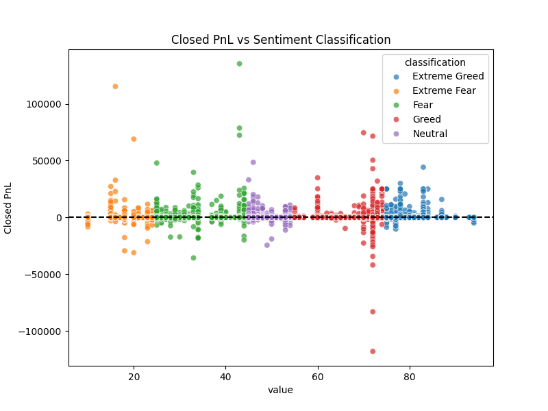

# ds_project

## Overview  
This repository contains my **Data Science assignment project**.  
It includes the notebook, analysis report, and visualizations created during the assignment.  

---

## Repository Structure  
- **ds_project.ipynb** → Jupyter Notebook with the full analysis and code.  
- **ds_report.pdf** → Report summarizing the project, results, and insights.  
- **barplot.png** → Bar plot visualization generated in the notebook.  
- **scatterplot.png** → Scatter plot visualization generated in the notebook.  
- **README.md** → Project description (this file).  

---

## Results & Visuals  

### Bar Plot  
  

### Scatter Plot  
  

---

## Report  
For a detailed explanation of methods, results, and insights, please check the [ds_report.pdf](ds_report.pdf).  

---

## How to Run  
1. Clone this repository:  
   ```bash
   git clone https://github.com/rajat-gupta3/ds_project.git
